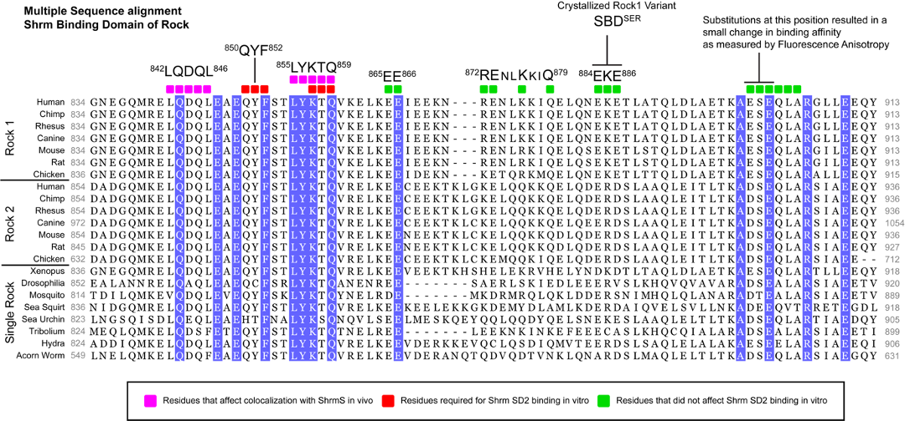
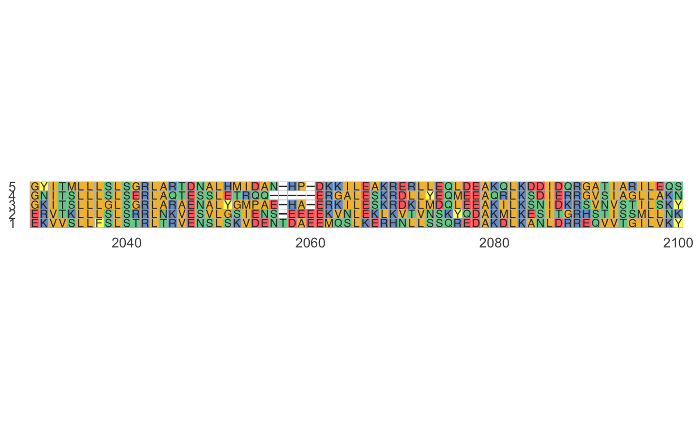
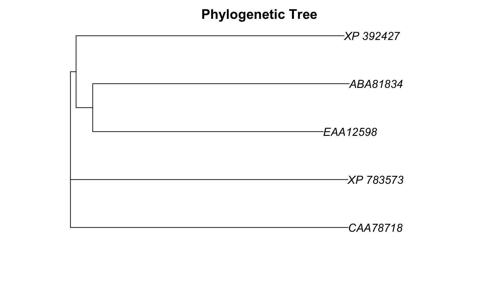

```{r setup, include=FALSE}
knitr::opts_chunk$set(echo = TRUE)


shroom_table <- c("CAA78718" , "X. laevis Apx" ,         "xShroom1",
                  "NP_597713" , "H. sapiens APXL2" ,     "hShroom1",
                  "CAA58534" , "H. sapiens APXL",        "hShroom2",
                  "ABD19518" , "M. musculus Apxl" ,      "mShroom2",
                  "AAF13269" , "M. musculus ShroomL" ,   "mShroom3a",
                  "AAF13270" , "M. musculus ShroomS" ,   "mShroom3b",
                  "NP_065910", "H. sapiens Shroom" ,     "hShroom3",
                  "ABD59319" , "X. laevis Shroom-like",  "xShroom3",
                  "NP_065768", "H. sapiens KIAA1202" ,   "hShroom4a",
                  "AAK95579" , "H. sapiens SHAP-A" ,     "hShroom4b",
                 #"DQ435686" , "M. musculus KIAA1202" ,  "mShroom4",
                  "ABA81834" , "D. melanogaster Shroom", "dmShroom",
                  "EAA12598" , "A. gambiae Shroom",      "agShroom",
                  "XP_392427" , "A. mellifera Shroom" ,  "amShroom",
                  "XP_783573" , "S. purpuratus Shroom" , "spShroom") #sea urchin
# What we just made is just one long vector with all the info.
# is(shroom_table)
# class(shroom_table)
# length(shroom_table)


# I'll do a bit of formatting; you can ignore these details if you want
# convert the vector to matrix using matrix()
shroom_table_matrix <- matrix(shroom_table,
                                  byrow = T,
                                  nrow = 14)

# convert the matrix to a dataframe using data.frame()
shroom_table <- data.frame(shroom_table_matrix, 
                     stringsAsFactors = F)

# name columns of dataframe using names() function
names(shroom_table) <- c("accession", "name.orig","name.new")

# Create simplified species names
## access species column using $ notation
shroom_table$spp <- "Homo"
shroom_table$spp[grep("laevis",shroom_table$name.orig)] <- "Xenopus"
shroom_table$spp[grep("musculus",shroom_table$name.orig)] <- "Mus"
shroom_table$spp[grep("melanogaster",shroom_table$name.orig)] <- "Drosophila"
shroom_table$spp[grep("gambiae",shroom_table$name.orig)] <- "mosquito"
shroom_table$spp[grep("mellifera",shroom_table$name.orig)] <- "bee"
shroom_table$spp[grep("purpuratus",shroom_table$name.orig)] <- "sea urchin"


```


The study of biology span a remarkable range of scales, from biochemical interactions at the scale of individual molecules to the functioning of the entire earth.  Despite this range, three tools play an important role across many of these scales: 

1. **Databases** of DNA and protein sequences  
1. **Alignments** of sequence data
1. **Phylogenetic trees** depicting evolutionary relationships

These three are interrelated, because alignments are built from DNA and protein sequences obtained from databases, and most phylogenetic trees are now built from sequence data, typically organized as a **multiple sequence alignment (MSA)**.  

Biochemists and molecular biologists use these tools to understand and predict the function of proteins.  For example, in the late 1990s researcher Jeffrey Hildebrand identified a protein that played a key roll in the development of vertebrate central nervous systems ([Hildebrand and Soriano 1999](https://www.sciencedirect.com/science/article/pii/S0092867400815378)).  He named the gene and protein "shroom" because when mutated the brain and skull of mice failed to form properly and bloomed out the back of their head like a fungus. 

Hildebrand determined the amino acid sequence of the protein and queried a database of DNA and protein sequences to see if *shroom* had ever been studied before.  It had in frogs, but its function was somewhat mis-characterized.  Over the last 20 years, Dr. Hildebrand and other researchers have shown that shroom occurs in many organisms and plays a central role in key stages of early development prior to birth, from the formation of fruit fly wings to proper formation of the spinal cord and central nervous system.  Recently, researchers have associated mutations in shroom to the incidence of the developmental disorder [spina bifida](https://www.cdc.gov/ncbddd/spinabifida/facts.html#:~:text=Spina%20bifida%20is%20a%20condition,not%20close%20all%20the%20way) ([Chen et al. 2018](https://link.springer.com/article/10.1007/s00439-017-1864-x), [Deshwar et al. 2020](https://onlinelibrary.wiley.com/doi/full/10.1111/cge.13804?casa_token=tL5doP9UXF8AAAAA%3AdouI80akWyKA-F7Td6RNtCt_EhN8lvMmqqXZp9Z8X2_N1VnjwbreUgzsBV_ufEgcJfRUOOsLSub3UMA)).  

Sequence databases play a key roll throughout this research for identifying other organisms that have the shroom gene ([Hagens et al. 2006](https://bmcmolcellbiol.biomedcentral.com/articles/10.1186/1471-2121-7-18)).  Indeed, the Hildebrand lab has leveraged the occurrence of shroom in fruit flies to study what shroom does at the cellular level, determine the role of the different variants of the shroom gene and proteins that occur in many organisms ([Bolinger et al. 2010](https://anatomypubs.onlinelibrary.wiley.com/doi/full/10.1002/dvdy.22326?casa_token=QaKkh-Gpj30AAAAA%3AJc4Ec-f13P2mseiOO1Cf0ib4Lqb7uoMuQ366d1sMjGrGMAjjxhdS_u580z2IZJ6wX_cqXQn_LssC31I)), and identify what other proteins *shroom* interacts with ([Hildebrand et al. 2021](https://journals.biologists.com/bio/article/10/2/bio055640/222728/A-modifier-screen-identifies-regulators-of)).

Multiple sequence alignments are often used to identify the parts of proteins that are likely involved in key functions, such as binding to other proteins or carrying out chemical reactions (e.g. [Mohan, Hildebrand et al. 2013](https://journals.plos.org/plosone/article?id=10.1371/journal.pone.0081075)).  This information can then be used when interpreting results from experiments or designing studies that mutate part of a protein to change its effect or prevent it from being created entirely.


```{r, echo = F,fig.cap="Alignment of focal part of the protein Rock1, which binds shroom.  Mohan et al. 2013 https://doi.org/10.1371/journal.pone.0081075.  CC-BY"}

#
```


Phylogenetic trees can be built from multiple sequence alignments to visualize the evolutionary relationships among genes.  


```{r, echo = F, fig.cap="Phylogenetic tree of shroom protein sequences"}

```


In subsequent posts, I will present a workflow for obtaining sequences, building an MSA, and creating a phylogenetic tree of the shroom gene family.  Many biologist will use web-browser based tools and GUI software such as MEGA to do this ([Kumar et al. 2008](https://academic.oup.com/bib/article/9/4/299/267027?login=true)); we'll do this all in a reproducible and extensible way in R.   

We will proceed through the following steps:

1. Starting with a set of published shroom gene identification numbers (Table 1; [Mohan, Hildebrand et al. 2013](https://journals.plos.org/plosone/article?id=10.1371/journal.pone.0081075)), we'll download shroom sequences using the rentrez package ([Winter 2017](https://peerj.com/preprints/3179/).
1. We'll then clean up the data a bit and explore alignments between pairs of sequences using pairwise alignments, thanks to the [Biostrings](https://bioconductor.org/packages/release/bioc/html/Biostrings.html) package.
1. Next, we'll build a full multiple sequence alignment using ([Bodenhofer et al. 2015](https://academic.oup.com/bioinformatics/article/31/24/3997/197486?login=true)).
1. We'll visualize a focal section of our shroom MSA using the ggplot2 extension [ggmsa](http://yulab-smu.top/ggmsa/articles/ggmsa.html#:~:text=ggmsa%20is%20a%20package%20designed,R%20extremely%20simple%20and%20powerful).
1. Finally, we'll build a phylogenetic tree with the [ape](https://cran.r-project.org/web/packages/ape/index.html) package.

 
After this series of blog posts is complete, future posts will provide more details about the biological, computational, and R programming aspects of these methods.


**Table 1**: shroom sequence identification codes (accession numbers) from  [Mohan, Hildebrand et al. 2013](https://journals.plos.org/plosone/article?id=10.1371/journal.pone.0081075).
```{r}
pander::pander(shroom_table)
```


