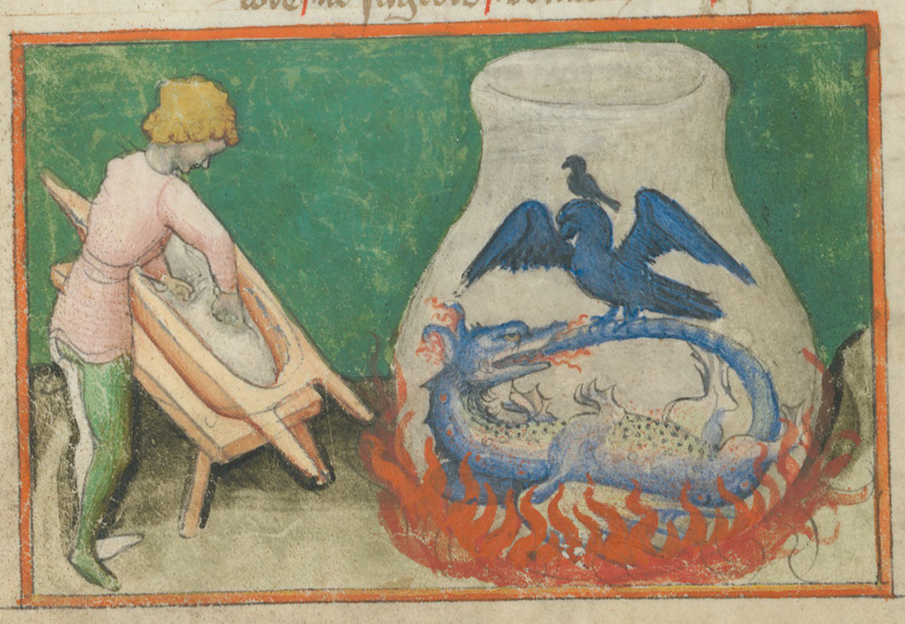

```{r setup,include=FALSE}
knitr::opts_chunk$set(echo = FALSE)
```


### Create a new post

This create the infrastructure for a post and and .Rmd with a basic YAML header".", Additional things can be added to the header (see below).


```{r,eval = F}
distill::create_post(
  title = "My package-maintenance workflow",# mandatory
  author = "Nathan L. Brouwer",
  slug = "auto",# generates a website slug (URL)
  date_prefix = TRUE,# adds date for sorting
  draft = FALSE,
  edit = interactive()
)
```


### YAML headers for posts

```{r,eval = F}
---
title: "Blood feud: ggplot versus base R for beginers"
description: |
  ggplot2 is powerful,but is it appropriate for complete beginners?
  author: Nathan L".",Brouwer
date: 2022-05-05
output:
  distill::distill_article:
  self_contained: false
draft: false
categories:
  - ggplot2 versus R
  - base R
  - time series
---
```


### Include images

I put the images in the same folder as the .Rmd file for the post".", If you don't include an image at the top of the .Rmd,distill will grab the the first figure from the post,if one is generated.

```{r,echo = F}

```


### Cropping images

The `magick` package is very useful for working with images.


```{r, eval = F}
library(magick)

img <- magick::image_read("Joseph_Wright_of_Derby_The_Alchemist.jpeg")
img <- image_scale(img,"300") # width: 300p,
print(img)
image_crop(img,"300","300+100+150")

image_write(img,path = "Joseph_Wright_of_Derby_The_Alchemist-CROPPED.jpeg")
```


### Ascii art

The logo I'm playing with 

https://ascii.co.uk/art/world
Brice Wellington from Winston Smith
```{r}
x <- read.csv("world2.csv")
x <- ifelse(x == ".",0,1)
x.df <- as.data.frame(x)
y <- 1:nrow(x.df)*-1
x.i <- rep(1,nrow(x.df))
plot(y ~ x.i, xlim = c(0,ncol(x.df)), pch = x.df[,1], col =  x.df[,1],
     xaxt = "n", yaxt = "n", xlab = "", ylab = "")
for(i in 2:ncol(x.df)){
  x.i <-  rep(i,nrow(x.df))
  z <- sample(c("A","T","C","G"),nrow(x.df),replace = T)
  q <- ifelse(z == "A",5,z)
  q <- ifelse(z == "T",2,q)
  q <- ifelse(z == "C",3,q)
  q <- ifelse(z == "G",4,q)
  q <- ifelse(x.df[,i] == 0,0,q)
  points(y ~ x.i, pch = z, col =  q)
}

```


This looks fun but isn't currently working for me. 

```{r, eval = F}
devtools::install_github("djnavarro/asciify")
library("asciify")
```


Brice Wellington from Winston Smith
https://ascii.co.uk/art/world


### Build the site

```{r,eval = F}
rmarkdown::render_site(encoding = 'UTF-8')
```


### Key resources

https://themockup.blog/posts/2020-08-01-building-a-blog-with-distill/

https://rstudio.github.io/distill/blog_workflow.html
