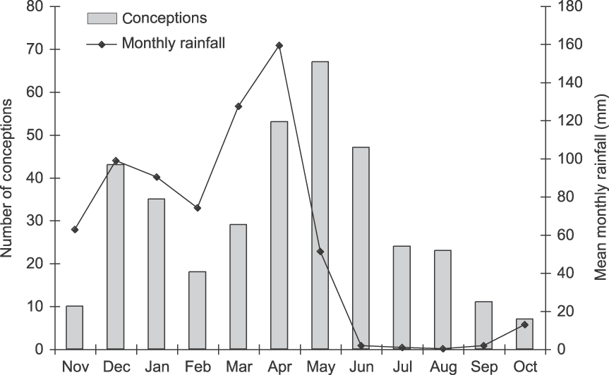

```{r setup, include=FALSE}
knitr::opts_chunk$set(echo = FALSE)
```

```{r,echo = F, fig.cap= "Foley & Faust (2010), Fig. 4"}

```

https://r-graph-gallery.com/145-two-different-y-axis-on-the-same-plot.html


A relatively type of plot in wildlife ecology is a dual-axis graph representing some aspect of a population using one axis, like birth rate, and the second representing an aspect of the environment.

There are arrangements for why dual-axis plots are a [poor choice for data viz](https://blog.datawrapper.de/dualaxis/), but I wanted to be able to show my students how to make them.  I'll use base R and `lattice` graphics in this post and perhaps try `ggplot2` in the future.


The example shown above is from a paper on African elephants by [Foley and Faust 2010](https://www.cambridge.org/core/journals/oryx/article/rapid-population-growth-in-an-elephant-loxodonta-africana-population-recovering-from-poaching-in-tarangire-national-park-tanzania/2DADFFCB562E9553B1DF7688EB372FBF). Called "Rapid population growth in an elephant *Loxodonta africana* population recovering from poaching in Tarangire National Park, Tanzania", in the animal conservation journal Oryx.

The left axis shows the estimated number of conceptions in the population (determined by back-calculating from date of birth) and the right axis shows rainfall.  It appears that elephant conception (and subsequent birth) is timed with the rains.

I extracted the data from Figure 4 of Foley and Faust (2010) using [`metaDigitise`](https://cran.r-project.org/web/packages/metaDigitise/vignettes/metaDigitise.html.

The dataset is small and reproduced below:

```{r}
month.i   <- c( 1,  2, 3, 4, 5, 6, 7, 8, 9,10,11, 12)
month.num <- c(11, 12, 1, 2, 3, 4, 5, 6, 7, 8, 9, 19)
month.name <- c("Nov",  "Dec", "Jan", "Feb",
                 "Mar",  "Apr", "May", "Jun",
                 "July", "Aug", "Sep", "Oct")
conceptions <- c(10, 42,34,18, 30, 55,68, 48,24,23,11,8)
rainfall    <- c(60,100,95,78,130,160,58,  4, 3, 3, 2,18)
```


#### Easy plot choice: side by side

The easiest way to display the data is in two side-by-side figures.  I'll use the function `mtext()` for the axes labels instead of the default locations. 


```{r}
par(mfrow = c(1,2), mar = c(4,4,1,2))
plot(conceptions ~ month.i, type = "b", xlab = "", 
     ylab = "", xaxt="n", pch = 16, cex = 1.25)
mtext(text = "Month", side = 1, line = 2.25, cex = 1.2)
mtext(text = "Conceptions", side = 2, line = 2, cex = 1.2)
axis(side = 1, at=1:12, labels=month.name)

plot(rainfall ~ month.i, type = "b", xlab = "", ylab = "", 
     xaxt="n", pch = 18, cex = 1.25)
mtext(text = "Month", side = 1, line = 2, cex = 1.2)
mtext(text = "Rainfall", side = 2, line = 2.25, cex = 1.2)
axis(side = 1, at=1:12, labels=month.name)
```
#### A dual axis graph

A dual-axis plot can be made using `lattice` graphics.  I'll make two separate plots, one barplot using `lattice::barplot()`, one line plot using `lattice::xyplot`, then overlay them.


First, I need `lattice` and `latticeExtra`.
```{r}
library(latticeExtra)
```

I'l bundel the data into a dataframe for convience
```{r}
df <- data.frame(month.i, 
                 month.name, 
                 conceptions, 
                 rainfall)

```

Now first, a barplot for the conceptions, stored in an object.

```{r}
conceptions <- barchart(conceptions ~ month.i, 
                 data = df, 
                 type = "l" , 
                horizontal = F,
                 lwd=2, col="darkgrey", 
                ylab = "Conceptions (grey bars)", 
                xlab = "Month", 
                main = "Elephant conceptions vs. rainfall, Tarangire NP Tanzania")

```

This looks nice enough:
```{r}
conceptions
```
Now the rainfall data using `xyplot`.
```{r}
rainfall <- xyplot(rainfall ~ month.i, df, type = "b", lwd=3, cex = 2, pch = 18, 
               ylab = "Rainfall (mm; blude triangles)",
               xlab = "Conceptions")
```


The plots are overlaid with dual axes using `latticeExtra::doubleYScale`

```{r}
doubleYScale(conceptions, rainfall, 
             add.ylab2 = TRUE,
             use.style=FALSE ,xlab = "")

```


#### References

Foley and Faust 2010](https://www.cambridge.org/core/journals/oryx/article/rapid-population-growth-in-an-elephant-loxodonta-africana-population-recovering-from-poaching-in-tarangire-national-park-tanzania/2DADFFCB562E9553B1DF7688EB372FBF). Called Rapid population growth in an elephant *Loxodonta africana* population recovering from poaching in Tarangire National Park, Tanzania.  Oryx 44:205 - 212.  https://doi.org/10.1017/S0030605309990706
